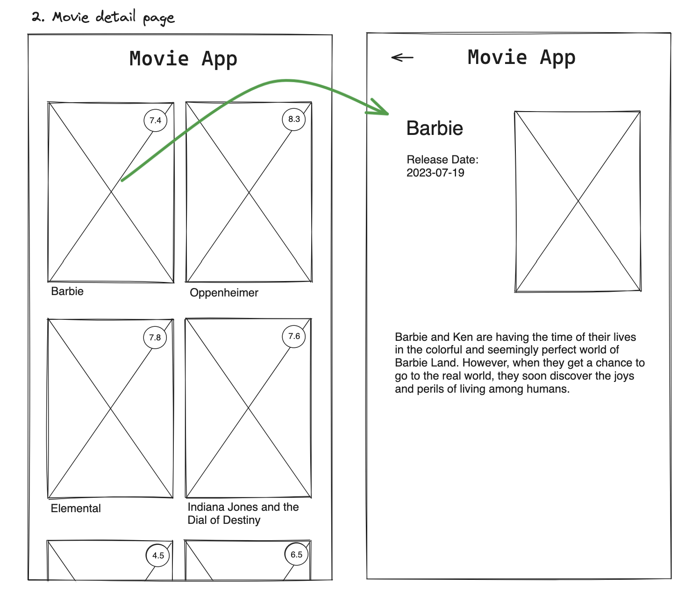

# Title

## Value Proposition

As a `Movie Enthausiast`  
I want to `click on one film`  
so that `I see details about the film.`  

## Description

## Acceptance Criteria

- When I click on one film, I can see a `single film displayed`
- Each Detail page shows the `movie component with a title,release date and a thumbnail`
- Under the thumbnail I can see a description about the movie.
- With a `Back-Button`in the upper left corner, I can go back to the overview-page.

## Tasks

- Create a new feature branch
- Create a `MovieDetailPage Component`
- Create a `Back-Button Component`
- Inside the `MovieDetailPage Component` render the Back-Button Component, the title, release date, Thumbnail Component and the description
